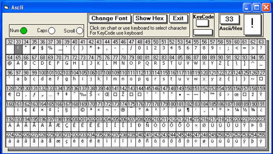



## Ascii\_KeyCode Chart

### Description

This is one of my unfinished projects, when I was learning to use control arrays.Ran across it and decided to finish it. I know there are a bunch of these already,but maybe there is something useful here.Happy coding.
 
### More Info
 

             |
---                |---
**Submitted On**   |2007-02-24 08:58:12
**By**             |[Kenneth Foster](https://github.com/Planet-Source-Code/PSCIndex/blob/master/ByAuthor/kenneth-foster.md)
**Level**          |Intermediate
**User Rating**    |5.0 (15 globes from 3 users)
**Compatibility**  |VB 6\.0
**Category**       |[Complete Applications](https://github.com/Planet-Source-Code/PSCIndex/blob/master/ByCategory/complete-applications__1-27.md)
**World**          |[Visual Basic](https://github.com/Planet-Source-Code/PSCIndex/blob/master/ByWorld/visual-basic.md)
**Archive File**   |[Ascii\_KeyC2049942242007\.zip](https://github.com/Planet-Source-Code/kenneth-foster-ascii-keycode-chart__1-67970/archive/master.zip)

